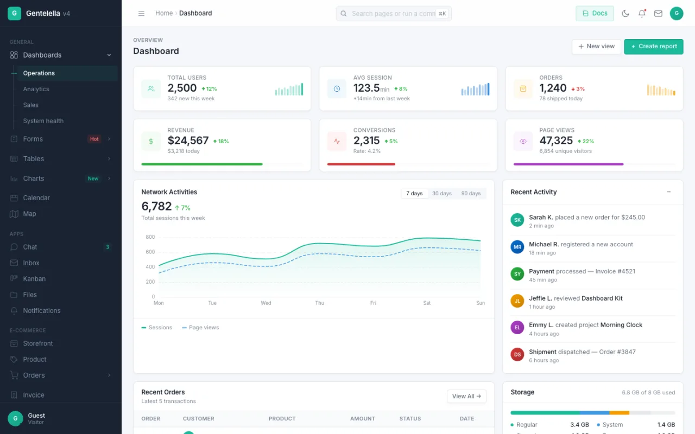
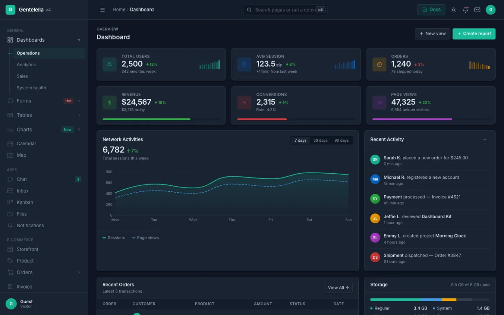
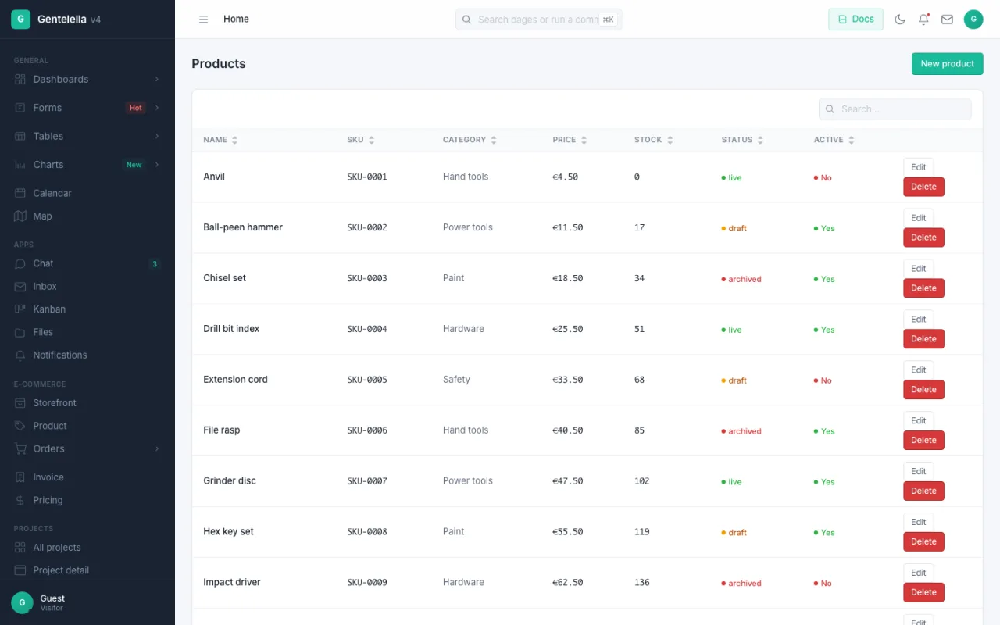
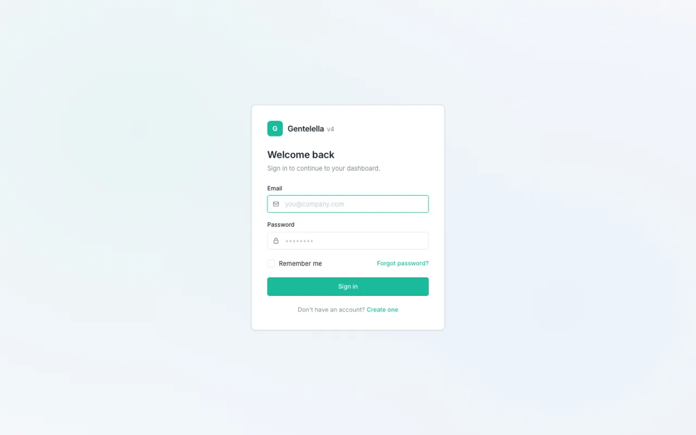

# Gentelella for Laravel

Official [Gentelella v4](https://github.com/ColorlibHQ/gentelella) integration for Laravel —
vanilla JS, SCSS, **no Bootstrap, no jQuery**, Vite-ready.

<p align="center">
  <a href="https://gentelella-laravel.colorlib.com"><strong>Live demo →</strong></a>
  &nbsp;·&nbsp;
  <a href="docs/README.md">Documentation</a>
  &nbsp;·&nbsp;
  <a href="docs/installation.md">Get started</a>
</p>

<p align="center">
  
  
</p>
<p align="center">
  
  
</p>

> **Status: in development.** Everything below works end to end and is covered by 331 tests plus a
> browser smoke suite. Not yet tagged or listed on Packagist — install from the repository for now.

**[Live demo →](https://gentelella-laravel.colorlib.com)** — the sign-in screen fills the demo
account in for you.

## Documentation

Full docs in [docs/](docs/README.md):
[Installation](docs/installation.md) ·
[Configuration](docs/configuration.md) ·
[Layout](docs/layout.md) ·
[Menu](docs/menu.md) ·
[Components](docs/components.md) ·
[CRUD](docs/crud.md) ·
[Columns](docs/columns.md) ·
[Fields](docs/fields.md) ·
[Authentication](docs/authentication.md) ·
[Demo](docs/demo.md) ·
[Commands](docs/commands.md) ·
[Deployment](docs/deployment.md)

## Requirements

| Requirement | Version |
|---|---|
| PHP | 8.3+ |
| Laravel | 13 |
| Node.js | 18+ (Vite asset pipeline) |

## Installation

```bash
composer require colorlibhq/gentelella-laravel
php artisan gentelella:install
```

The installer publishes `config/gentelella.php`, drops the Vite entry stubs into
`resources/css/gentelella.scss` and `resources/js/gentelella.js`, and offers to `npm install` the
two frontend dependencies — `gentelella@^4.1` and `sass`. ECharts, DataTables and Leaflet stay
opt-in, mirroring the lazy vendor chunks in the upstream template.

## The sidebar menu

A single array in `config/gentelella.php`. Leave it `null` to use the bundled demo sidebar, which
is generated from `NAV` in the upstream template — run `npm run export:php` in
[ColorlibHQ/gentelella](https://github.com/ColorlibHQ/gentelella) to regenerate
`resources/menu.php` and `resources/icons.php` so the two editions cannot drift apart.

```php
'menu' => [
    [
        'label' => 'General',
        'items' => [
            ['key' => 'dashboard', 'text' => 'Dashboard', 'icon' => 'dashboard', 'route' => 'admin.dashboard'],
            [
                'text' => 'Catalogue',
                'icon' => 'shop',
                'children' => [
                    ['key' => 'products', 'text' => 'Products', 'route' => 'admin.products.index'],
                    ['key' => 'categories', 'text' => 'Categories', 'route' => 'admin.categories.index',
                     'can' => 'manage-catalogue'],
                ],
            ],
        ],
    ],
],
```

Address a target with **one** of `url` (verbatim), `route` (a route name, plus optional
`route_params`), or `page` (a bundled demo page slug). `key` is matched against the current page
key to mark an item active; a parent opens when any of its children is active.

An unresolvable target renders as `#` rather than throwing — a menu entry pointing at a route the
app hasn't defined yet should be inert, not a 500.

### Menu filters

Applied in order to every item, configurable via `gentelella.filters`:

| Filter | Does |
|---|---|
| `GateFilter` | Drops items whose `can` ability the current user fails. No `can` key means always visible — authorisation is explicit, never inferred. |
| `HrefFilter` | Resolves `url` / `route` / `page` to a concrete href. |
| `ActiveFilter` | Marks the active leaf and opens its parent. |
| `SearchFilter` | Collects reachable leaves for the ⌘K command palette and breadcrumb resolution. |

A parent whose children were all dropped is dropped too, so no empty submenus render.

## Pages

```blade
@extends('gentelella::page')

@section('title', 'Dashboard')
@section('page_key', 'dashboard')
@section('breadcrumb', 'Home > Dashboard')

@section('content')
    <div class="card">…</div>
@endsection
```

A controller may pass `$pageKey` and `$breadcrumb` as view data instead; the variables win over the
sections. For screens with no sidebar — auth, errors, landing — extend `gentelella::layouts.blank`.

DOM order matches the static template exactly: skip link, sidebar, topbar, then `<main>` with the
footer inside it, so the compiled CSS applies unchanged.

## Components

24 anonymous Blade components, extracted from the static template's own markup rather than
designed fresh — the compiled CSS applies unchanged.

```blade
<x-gentelella::page-header title="Customers" pretitle="Data">
    <x-slot:actions>
        <x-gentelella::btn variant="primary">New customer</x-gentelella::btn>
    </x-slot>
</x-gentelella::page-header>

<x-gentelella::card title="All customers" subtitle="Sortable, searchable, paginated." flush>
    <x-slot:options><x-gentelella::card-options /></x-slot>

    <x-gentelella::table datatable :page-length="10" selectable export="customers">
        <tbody>
            <tr>
                <td><x-gentelella::avatar name="Ada Lovelace" size="sm" status="online" /></td>
                <td><x-gentelella::status tone="green">Paid</x-gentelella::status></td>
                <td><x-gentelella::progress :value="72" tone="primary" /></td>
            </tr>
        </tbody>
    </x-gentelella::table>
</x-gentelella::card>
```

| | |
|---|---|
| **Layout** | `card`, `card-options`, `page-header`, `divider`, `table` |
| **Data** | `stat`, `progress`, `status`, `badge`, `chip`, `avatar`, `timeline`, `timeline-item` |
| **Navigation** | `tabs`, `accordion`, `accordion-item`, `list-group`, `list-group-item` |
| **Feedback** | `banner`, `empty-state`, `skeleton`, `spinner` |
| **Controls** | `btn`, `toggle` |

Every component forwards extra attributes, so `class` and `data-*` merge rather than replace:

```blade
<x-gentelella::card class="chart-card" data-chart="revenue">…</x-gentelella::card>
{{-- <div class="card chart-card" data-chart="revenue"> --}}
```

Values that land inside an inline `style` — `progress`'s `value` and `tone`, `stat`'s `spark`
heights — are clamped and sanitised, so data from the database cannot break out of the attribute.

For overlays use the JavaScript helpers the template already ships (`showModal()`, `showToast()`,
`openMenu()`) rather than hand-rolling markup.

## CRUD

Describe a screen, register it, done. No `resources/` to publish and no generated controller you
have to keep in sync — the panel *is* the definition.

```php
class ProductController extends \ColorlibHQ\Gentelella\Crud\ResourceController
{
    protected function setup(): void
    {
        $this->panel
            ->model(Product::class)
            ->route('admin/products')
            ->entity('product', 'products')
            ->columns([
                ['name' => 'name', 'searchable' => true, 'strong' => true],
                ['name' => 'category', 'type' => 'relationship', 'attribute' => 'title'],
                ['name' => 'price', 'type' => 'money', 'symbol' => '€'],
                ['name' => 'status', 'type' => 'status', 'tones' => ['live' => 'green', 'draft' => 'yellow']],
            ])
            ->fields([
                ['name' => 'name', 'rules' => 'required|max:255'],
                ['name' => 'category_id', 'type' => 'select_from_model', 'model' => Category::class, 'attribute' => 'title'],
                ['name' => 'price', 'type' => 'number', 'rules' => 'required|numeric|min:0'],
                ['name' => 'active', 'type' => 'switch'],
            ]);
    }
}
```

```php
Route::gentelella('admin/products', ProductController::class);
```

Or skip the typing — the generator reads your table and writes the controller:

```bash
php artisan gentelella:crud Product
```

It infers column and field types from the database (including `tinyint(1)` as a boolean and a
`*_id` column as a belongs-to select), derives validation rules from nullability and defaults, and
leaves you a plain PHP file to edit. Schema introspection goes through Laravel's own schema
builder — no `doctrine/dbal`.

### Operations

Each operation is a trait on `ResourceController`. Compose only what you want and the route macro
registers only what exists, so dropping delete leaves no delete route rather than one that 500s.

| Trait | Routes |
|---|---|
| `ListRecords` | `index`, `data` |
| `CreateRecord` | `create`, `store` |
| `UpdateRecord` | `edit`, `update` |
| `DeleteRecord` | `destroy` |
| `ShowRecord` | `show` |

`Route::gentelella()` also takes `only`, `except`, `as` and `middleware`.

### Tables are server-side

The list screen paints immediately with an empty table and pulls rows from a JSON endpoint, so the
first byte never waits on the query. Search, ordering and paging all happen in SQL.

A few behaviours worth knowing, because they are deliberate:

- **Page length is capped** at `DataTableResponder::MAX_PAGE_LENGTH` (200). `length` comes from the
  query string and DataTables sends `-1` for "all"; honouring either literally would let a stranger
  ask for the whole table.
- **`%` and `_` in a search term are literals.** Both are escaped and the query states an explicit
  `ESCAPE` clause — SQLite defines no default one, so without it a search for `%` quietly returns
  every row.
- **Ordering direction is never interpolated.** Anything that is not `desc` is `asc`.
- **Relationship columns are eager-loaded**, so rendering a page is a fixed number of queries.
- **Ordering by a to-many relationship is refused** rather than joined — there is no single value to
  sort on, and a join would silently duplicate rows.
- **Only declared fields are saved.** The field list is the mass-assignment allowlist, whatever the
  request contains.

### Column and field types

**Columns** — `text`, `number`, `money`, `boolean`, `status`, `date`, `datetime`, `relationship`,
`link`, `image`, `array`, `progress`, `closure`, `actions`.

**Fields** — 28 types: the native inputs, plus `select_from_model`, `multi_select`, `checklist`,
`rich_text`, `date_range`, `upload`, `avatar`, `otp` and `repeatable`. See [docs/fields.md](docs/fields.md).

An unknown type falls back to `text` in both cases: a typo should show the value, not break the
page.

Validation rules may be a closure receiving the record, which is what lets a unique rule ignore the
row it belongs to:

```php
['name' => 'sku', 'rules' => fn (?Product $entry) => [
    'required', Rule::unique('products', 'sku')->ignore($entry?->getKey()),
]],
```

## Authentication

Sign-in, registration and password-reset screens on the template's own auth markup.

```php
// config/gentelella.php
'auth' => ['enabled' => true],
```

That is the whole setup. Routes are registered under Laravel's conventional names — `login`,
`register`, `password.request`, `password.reset` — because the framework's auth middleware
redirects to `login` by name and the password broker emails a link to `password.reset`. Anything
else would work only when reached by hand.

**It never shadows auth you already have.** Registration is deferred until every provider has
booted, so the application's own route files have already loaded; any screen whose route name
exists is skipped. An app on a starter kit can turn this on and keep its own sign-in.

Each screen can be switched off on its own — a closed system wants `login` without `register`:

```php
'auth' => ['enabled' => true, 'register' => false, 'reset' => true, 'home' => '/admin'],
```

### What the screens do

- **Failed sign-ins are rate limited**, keyed by email *and* IP so one attacker cannot lock a real
  user out. Configurable via `auth.throttle`; `0` disables it.
- **The session id is rotated on sign-in**, so a session fixed beforehand is worthless.
- **A wrong password and an unknown address give the same message**, and a reset request gives the
  same answer either way — neither form can be used to find out which accounts exist.
- **Resetting rotates the remember token**, invalidating any "remember me" cookie issued before it.
- Passwords are validated with `Password::defaults()`, so your app's own policy applies.

### Owning the code

```bash
php artisan gentelella:make-auth
```

Copies the controllers into `app/Http/Controllers/Auth` under your namespace, the views into
`resources/views/vendor/gentelella/auth`, and a route file to `routes/gentelella-auth.php`. Require
that file and set `'auth' => ['enabled' => false]` so the two do not both register.

## The bundled demo

Every page from the static template, served from your own app. Off by default so a consumer app
ships none of it.

```php
// config/gentelella.php
'demo' => true,
```

```bash
php artisan gentelella:demo   # migrate + seed the demo data
```

Then browse `/demo`. The pages are generated from the static template by
`npm run export:demo` in [ColorlibHQ/gentelella](https://github.com/ColorlibHQ/gentelella), so they
cannot drift from the HTML edition, and each one keeps its own `<script>` block — 25 of the 58
pages carry their behaviour there.

**Tables is a real CRUD panel**, not static markup: a seeded catalogue of 25 products with
server-side search, sorting and paging, and working create/edit/delete. It is the same
`ResourceController` you would write yourself.

Demo tables are prefixed `gentelella_demo_` so switching the demo on cannot shadow your own
`products` or `categories`.

## Breadcrumbs

Same grammar as the static template's `data-breadcrumb`:

```php
$gentelella->breadcrumb('Home > Projects|/projects > Acme Redesign');
```

Every crumb but the last resolves to a link — explicit target after `|`, then an exact label match
against the menu, then plain text. The last crumb is the current page and is never a link.

## Roadmap

- [x] Package scaffolding, config, service provider
- [x] Menu layer — builder, four filters, breadcrumb resolution, generated icons
- [x] Blade layout and shell partials (sidebar / topbar / footer)
- [x] `gentelella:install` and Vite entry stubs
- [x] Component library — 24 Blade components
- [x] CRUD engine — panel, five operations, server-side tables, `gentelella:crud` generator
- [x] 14 column types · 18 field types
- [x] Demo application — 57 generated pages + 1 CRUD-backed, with data and seeder
- [x] 28 field types, including date range, multi-select, rich text, upload, avatar, repeatable
- [x] List filters
- [x] Browser smoke test
- [x] Reorder operation and CSV export
- [x] Error pages and JSON translations
- [x] Auth — login, registration, password reset, `gentelella:make-auth`
- [x] Documentation — [docs/](docs/README.md)
- [x] Live demo — [gentelella-laravel.colorlib.com](https://gentelella-laravel.colorlib.com)
- [ ] Tagged release and Packagist listing

## Development

```bash
composer install
composer check      # pint --test, phpstan, pest
```

## License

MIT. See [LICENSE](LICENSE).
